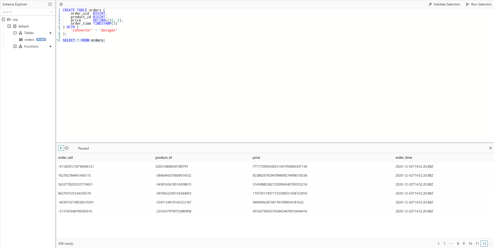

# 01 Creating Tables

Flink SQL operates against logical tables, just like a traditional database.
However, it does not maintain tables internally but always operates against external systems.

Table definitions are in two parts; the logical schema and connector configuration. The logical schema defines the columns and types in the table and is what queries operate against. 
The connector configuration is contained in the `WITH` clause and defines the physical system that backs this table. 
This example uses the `datagen` connector which generates rows in memory and is convenient for testing queries.

You can test the table is properly created by running a simple `SELECT` statement. 
In Ververica Platform you will see the results printed to the UI in the query preview.

## Script

```sql

CREATE TABLE orders (
    order_uid  BIGINT,
    product_id BIGINT,
    price      DECIMAL(32, 2),
    order_time TIMESTAMP(3)
) WITH (
    'connector' = 'datagen'
);

SELECT * FROM orders;
```

## Example Output


